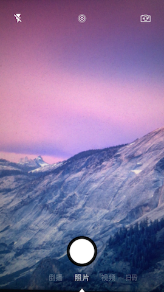
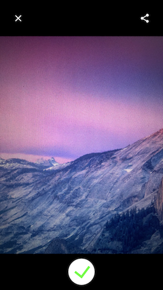
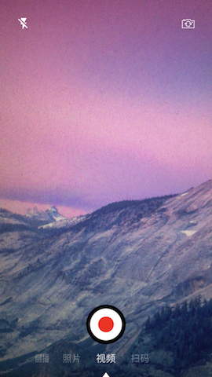
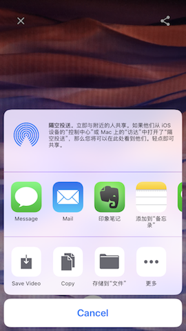
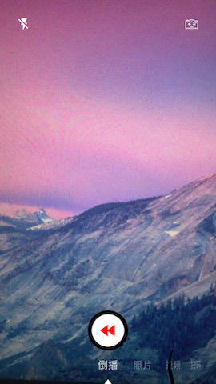
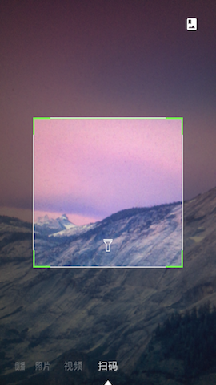
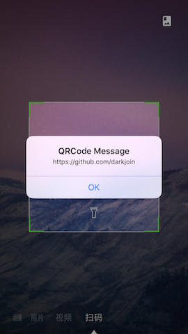

# CustomCamera

使用AVFoundation实现的自定义相机，有拍照、视频、倒播、扫码四种模式。主要功能有：

- 支持横屏拍摄和竖屏拍摄。
- 支持live photo。
- 支持前后摄像头的转换、支持闪光灯和手电筒模式。
- 支持预览、保存和分享。
- 在扫码模式下，支持实时扫描二维码和从相册读取二维码。

### 1 拍照

  

### 2 拍视频

  

### 3 拍倒播

 

### 4 扫描二维码

 
